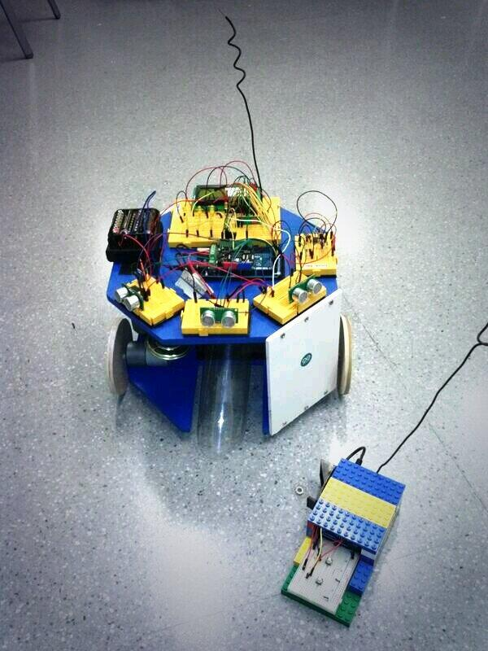

# Limpiosity Documentation

## Introduction

**Limpiosity** is a robot, a spanish robot. It is based in both open software & hardware such as [Arduino](http://www.arduino.cc/). It is only made for educational and learning purpose. This page will only contain the *libraries* made to control some parts, for further information like construction materials and electronic circuits, visit [Limpiosity's site](http://www.vicenteortiz.me).

## Installation

### Pre-requisites
You must have installed [Arduino's IDE](http://arduino.cc/en/Main/Software).

### How to
1. Copy `libraries` folder to your arduino installation path, on windows `C:\no\me\acuerdo\`.
2. Upload `transmission.ino` to your arduino uno board, the remote control.
3. Upload `main_loop_v3.ino` to your arduino mega board.
4. Switch everything on and enjoy!

## Hardware used

+ Arduino mega (Limpiosity's brain)
+ Arduino uno (Remote control)
+ Lots of sensors to make some noise and movement, check them out in [here](http://www.vicenteortiz.me)

## Other libraries

+ [VirtualWire](http://www.airspayce.com/mikem/arduino/VirtualWire.pdf) (Remote control)

## Pins

#### Motors
+ int _enable1 = 5;//motor izquierda
+ int _direction1 = 4;//motor izquierda
+ int _enable2 = 6;  // motor derecha
+ int _direction2 = 7; //motor derecha

#### Ultrasonidos
+ izquierda_ultrasonidos 
+ echo azul 40
+ triger verde 42

+ centro_ultrasonidos
+ echo azul 44
+ triger verde 46

+ derecha_ultrasonidos
+ echo azul 48
+ echo verde 50

#### Piezo
piezo = 10

#### LCD
pins 11,12,22 al 36

#### LEDs in the darkness
51,13,9,8

#### Conexión inalámbrica
data 45

----------------------------------------------
## Authors

+ David Martinez
+ Manu Rubio
+ Vicente Ortiz